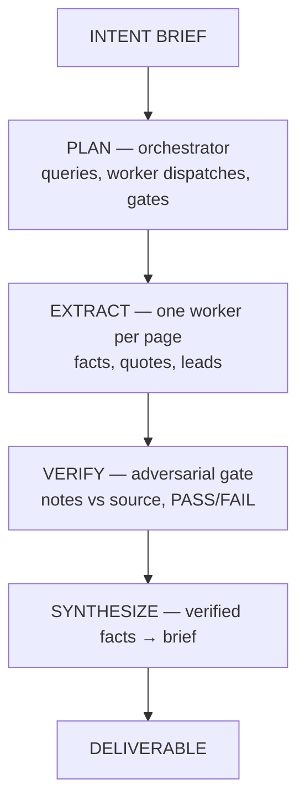

# Benchmarks

Scope: this file only carries **task-quality** results — prompts scored
against expected results we create and manage (hand-planted errors, judge
rubrics, frozen real-mission cases). Generic provider mechanics (token
rate, TTFT, cost per probe) live in
[llm-meter's BENCHMARKS.md](https://github.com/eanderson4/llm-meter/blob/main/BENCHMARKS.md).

Dated snapshots of `research bench` across worker models. Cases are frozen
snapshots from real missions (see [`bench/README.md`](bench/README.md));
raw per-run data is [`bench/results.jsonl`](bench/results.jsonl). Reproduce
with:

```bash
research bench run --suite verify --model flash,pro,glm,k3,fable,sol
research bench report
```

Model aliases: `flash` = deepseek-v4-flash, `pro` = deepseek-v4-pro,
`glm` = glm-5.2 via z.ai, `k3` = kimi-k3, `fable` = claude-fable-5,
`sol` = gpt-5.6-sol. Costs are computed at published list rates, even for
models accessed via coding-plan endpoints (k3, glm) — list price is the
comparison basis on purpose.

## The suites

The bench mirrors the pipeline — each suite attaches to one stage:



In pipeline order:

- **`plan` — can this model orchestrate?** The entry point. The benched
  model plays planner: given a real mission's intent brief, produce an
  executable research plan — concrete queries, worker dispatches,
  receipts discipline, verification gates. Judged 0–10 against the real
  mission's own plan as a baseline (not a ceiling). Thinnest suite;
  treat it as indicative. Caveat: real orchestration is *iterative* —
  clarify the brief with the architect, run orientation queries, dispatch
  a wave of workers, read the summaries, then dispatch the next wave.
  This suite benches only the first move, not the loop.
- **`extract` — can this model pull the facts?** The benched model plays
  extraction worker on one cached page. Scored **deterministically**
  against a hand-authored `facts.json`: 13–14 must-capture items per case
  (exact figures, dates, names, plus anti-hallucination checks — pass =
  you didn't invent a price the page never states). Score = 10 × recall.
  No judge, no LLM-grading-LLM. This is the step cheap models are
  *supposed* to be good enough for — the suite that proves or punctures
  it.
- **`verify` — can this model fact-check?** The gate: only verified
  facts reach the deliverable. The benched model gets research notes
  plus the source they cite, and must pass clean notes and fail dirty
  ones. Ground truth is hard, not judged: `planted-*` cases contain
  hand-planted errors listed in the case file (score 10 = correct
  verdict). Two failure modes matter separately — *missing* a real error
  lets bad facts through, and *false-alarming* on clean notes wastes
  human review. The table's single score hides which one happened; the
  per-case rows in `results.jsonl` show it (`flagged` on a `clean-*`
  case = false positive).
- **`summarize` — can this model turn facts into a brief?** The
  synthesis step: compress extracted facts into notes a deliverable can
  use. Two independent scores: an LLM judge rates coverage / precision /
  leads (0–10, taste), and the adversarial verifier re-checks every
  claim against the source (`vpass` = survived, facts). The gap between
  the two is the interesting signal — models can write summaries a judge
  loves that don't survive fact-checking.

The judge and the summarize-suite verifier always run on registry
defaults (currently `pro`), independent of the model being benched — so
worker-model comparisons stay apples-to-apples.

## 2026-07-21 — six-model sweep (23 cases)

```
suite      model     tag         n  score  vpass   $/case    sec  errs
----------------------------------------------------------------------
plan       fable     -           2    9.2      -   0.1992     50     0
plan       flash     -           2    8.5      -   0.0011     32     0
plan       glm       -           2    7.0      -   0.0126     48     0
plan       k3        -           2    8.0      -   0.0384     65     0
plan       pro       -           2    8.0      -   0.0038     79     0
plan       sol       -           2   10.0      -   0.1897    109     0
extract    fable     -           4    9.8      -   0.1499     26     0
extract    flash     -           4    9.7      -   0.0005     18     0
extract    glm       -           4    9.4      -   0.0117     35     0
extract    k3        -           4    9.7      -   0.0263     41     0
extract    pro       -           4    9.4      -   0.0018     21     0
extract    sol       -           0      -      -        -      -     -
verify     fable     -           8    8.8      -   0.2309     48     0
verify     flash     -           8    8.8      -   0.0013     37     0
verify     glm       -           8    8.8      -   0.0192     40     0
verify     k3        -           8    7.5      -   0.0428     48     0
verify     pro       -           8   10.0      -   0.0052     46     0
verify     sol       -           8    6.2      -   0.1394     57     0
summarize  fable     -           9    9.4    6/9   0.1635     27     0
summarize  flash     -           9    8.9    4/9   0.0006     12     0
summarize  glm       -           9    8.6    6/9   0.0092     36     0
summarize  k3        -           9    8.7    6/9   0.0264     47     0
summarize  pro       -           9    9.1    5/9   0.0022     27     0
summarize  sol       -           0      -      -        -      -     -
```

`score`: judge 0–10; on `verify` it's 10 = correct verdict against hard
ground truth (hand-planted errors). `vpass`: fraction of summaries that
survived adversarial verification against their sources. `n` is cases
(latest result per case); single run per case, so run-to-run variance is
not yet captured.

Reading this table:

- **Extraction recall is commoditized — the cheap-tier hypothesis
  holds.** On deterministic fact-recall, `flash` scores 9.7 at
  **$0.0005/case** — statistically indistinguishable from `fable`'s 9.8
  at 300× the price. Everyone lands 9.4–9.8. This is the empirical case
  for running the worker tier on cheap models. (`sol`'s extract row is
  missing: OpenAI quota ran out mid-sweep; will backfill.)
- **Where extraction still separates: buried requirements.** The one
  discriminative fact in the suite is a two-year monitoring obligation
  deep in a 23KB grant RFA — 5 of 6 models missed it; only `fable`
  caught it. Volume facts are free; needle-in-document recall is what's
  left to compete on.
- **No model wins everywhere — the roles genuinely separate.**
  - *Verifier:* `pro` is the only perfect score (10/10 — no missed plants,
    no false positives) at $0.005/case. Everyone else false-alarmed on
    clean notes at least once; `sol` did it on 3 of 4 clean cases (6.2),
    which would bury a human reviewer in bogus flags.
  - *Summarizer (synthesis):* `fable` leads on judge score (9.4) with
    6/9 verification survival; the pack is tight (8.6–9.4 judged, 4–6/9
    survived). Note this suite now feeds models a reference extraction
    (`facts.md`), not the raw page — scores are not comparable with the
    earlier raw-source sweeps, and `sol`'s row is pending OpenAI quota.
  - *Planner:* `sol` 10/10 — but n=2 cases, so treat the whole suite as
    indicative, not ranked.
- **The cheap tier holds up embarrassingly well.** `flash` (deepseek
  flash) verifies at 8.8 for $0.0013/case — 175× cheaper than fable's
  verify row — and its failures are false positives, the safe direction
  for a gate.
- **Harness lesson from this sweep:** reasoning models (pro, sol, k3,
  fable) reject `temperature`/`max_tokens` conventions of older
  endpoints and silently return empty completions when their token cap
  is eaten by reasoning. Empty completions now raise instead of scoring
  as zero; judge/verifier/planner caps were raised accordingly. Earlier
  "pro = 0.0 on plan" was this bug, not a model result.
- **`$/case` is the benched model only.** `summarize`/`plan` also burn
  judge+verifier overhead on registry defaults (`overhead_cost_usd` in
  the JSONL).
- Case mix: gov grant programs, grid-battery reports, robot spec sheets,
  an arXiv drone-inventory paper, plus the original water/energy set.

## 2026-07-17 — first sweep (superseded, kept for history)

```
suite      model     tag         n  score  vpass   $/case    sec  errs
----------------------------------------------------------------------
plan       flash     -           1    9.0      -   0.0013     37     0
plan       glm       -           2    7.0      -   0.0126     48     0
plan       pro       -           2    0.0      -   0.0041     75     0
summarize  flash     -           1    8.5    0/1   0.0007     12     0
summarize  glm       -           4    9.7    1/4   0.0143     32     0
summarize  pro       -           4    9.0    3/4   0.0042     35     0
verify     flash     -           5   10.0      -   0.0019     35     0
verify     glm       -           5    8.0      -   0.0217     47     0
verify     pro       -           4   10.0      -   0.0063     58     0
```

First cross-model run, before the forestry-mission cases were added. The
`plan pro = 0.0` row was later traced to the empty-completion harness bug
described above, not to the model.
